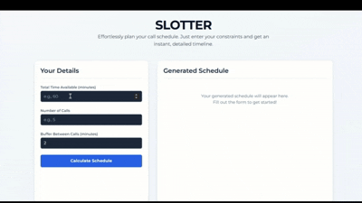

# SLOTTER 

**Split your time. Own your calls. Done.**

SLOTTER takes a block of total time, the number of calls you need to make, and optional buffer minutes, then outputs a clean schedule. No guessing. No wasted minutes.




## WHY

Because time is finite and calls are endless. SLOTTER keeps your day from eating itself.


## HOW TO USE

1. Visit live demo or open 'index.html' in a browser.
2. Enter:
     - **Total time** (minutes)
     - **Number of calls**
     - **Buffer time between calls** (optional, default= 2 min)
3. Click **Calculate**.
4. See your schedule. Copy it. Use it.


## LIVE DEMO

[SLOTTER](https://slotter.vercel.app)


## TECH STACK

- React 19
- TypeScript
- Vite
- Tailwind CSS
- ESLint (Flat Config)
- Docker (optional)


## LICENSE

This project is licensed under the MIT license.


## LOCAL SETUP

```bash
npm install
npm run dev


